# 🌍 Global Electronics Retailer – SQL + Tableau Project

This project analyses the operations of a **global electronics retailer** using SQL and Tableau. It provides insights into sales performance, delivery trends, and customer behaviour, and visualises the findings through an interactive Tableau dashboard.

---

## 📊 Tableau Dashboard Highlights

🔍 **Explore the live dashboard here:** [Tableau Public Link](https://public.tableau.com/app/profile/jamie.chau/vizzes)

---

## 📌 Summary

This repository contains the Tableau dashboard workbook and the SQL queries used to generate core insights. The project explores revenue, orders, delivery performance, customer cohorts and store performance across countries and product categories.

## 🎯 Project Objective

- Query and aggregate raw sales data using SQL to answer key business questions.
- Visualise monthly trends, top/bottom performers, delivery speed and customer behaviour in Tableau.

---

## 🧰 Tools & Technologies

- **SQL Server**  
- **Tableau Public**  
- **SSMS (SQL Server Management Studio)**  
- **Excel / CSV files**

---

## 📁 Dataset Overview

The dataset includes multiple tables such as:

- `Orders` – sales and delivery data  
- `Customers` – demographics and geography  
- `Products` – categories and pricing  
- `Stores` – physical store locations  

---

## 📈  Dashboard Pages & Visuals

**1. Sale Overview** 

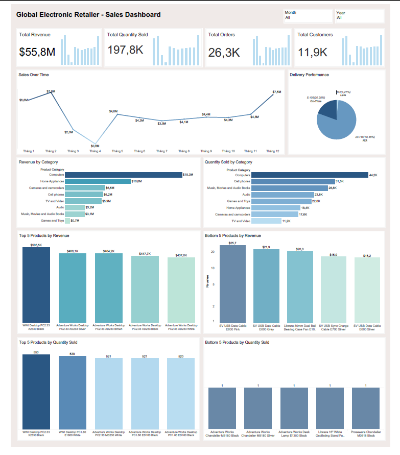
   
   - KPI cards: Total Revenue,  Total Quantity Sold, Total Orders Total Customers
   - Sales over Time: Days/Month/Year with YOY variance
   - Delivery Performance
   - Revenue/Quantity Sold by Category
   - Top/Bottom Product by Revenue
   - Top/Bottom Product by Quanity Sold

**2. Sales by Country**

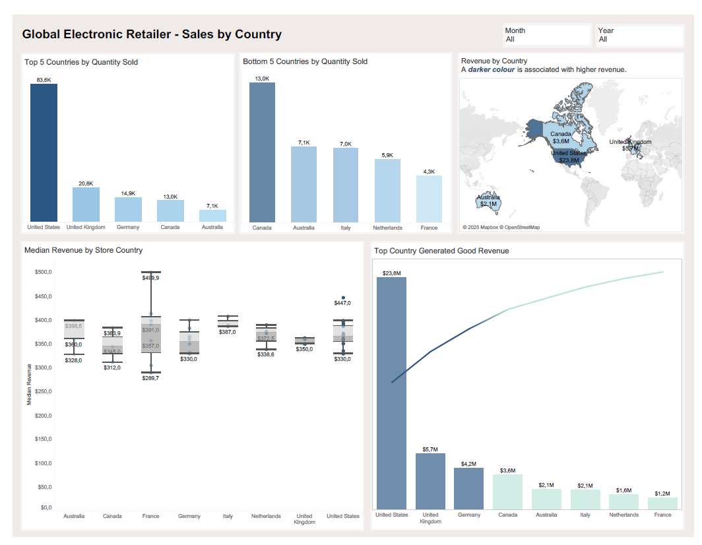
   
   - Top Countries Generated Good Revenue
   - Top/Bottom Product by Quanity Sold

**3. Customer Overview**

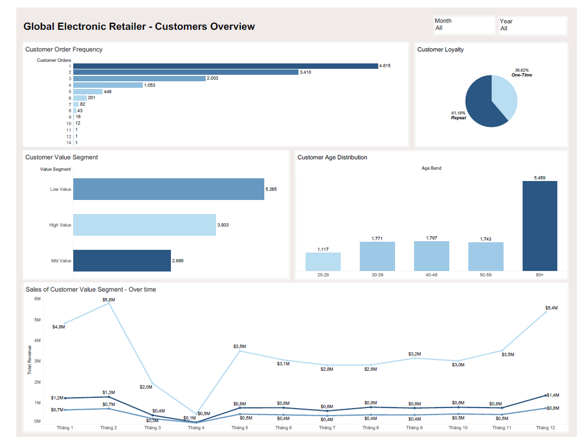
   
   - Customer Order Frequency
   - Customer Loyalty
   - Customer Value Segment
   - Customer Age Distribution

**4. Customer Cohort Analysis**

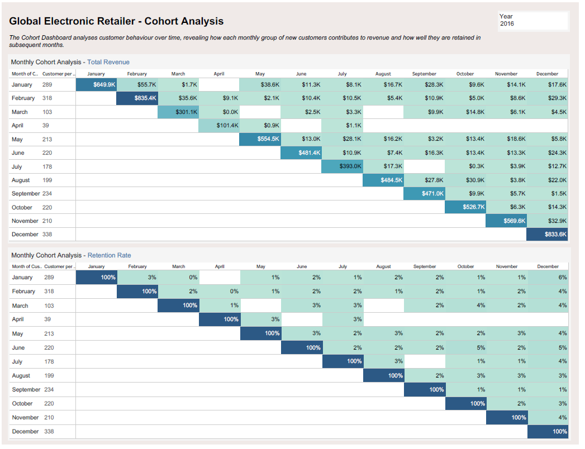

     
## 🔍 Key Insights
     
- **Category leaders:** Computers ($19.3M) and Home Appliances ($10.8M) drive most revenue; Games & Toys is the smallest (~$0.7M).

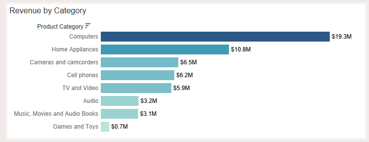 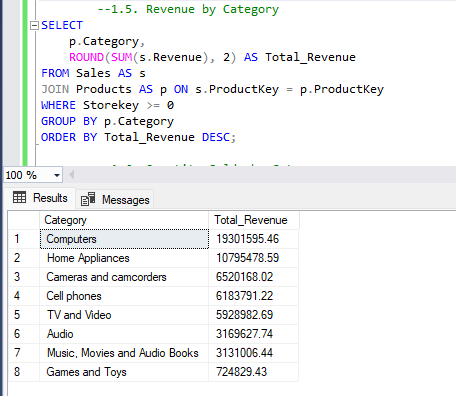

- **Demand volume:** Units strongest in Computers (44.2K) and Cell Phones (31.5K).

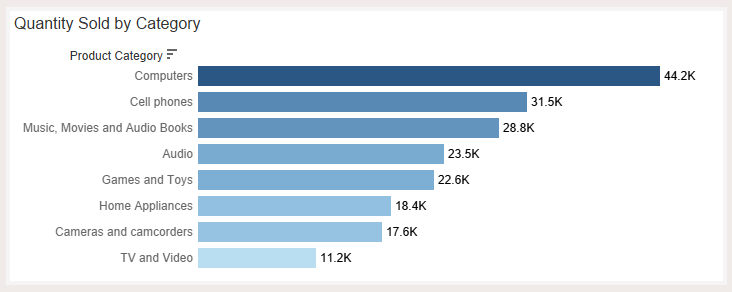 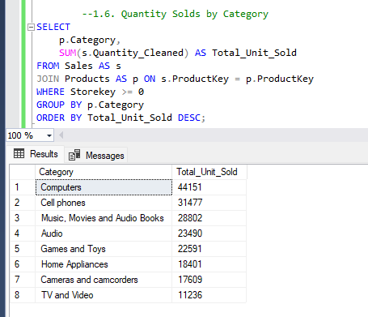

- **Top products:** Desktop PC variants lead (top item ≈ $505.5K revenue).

 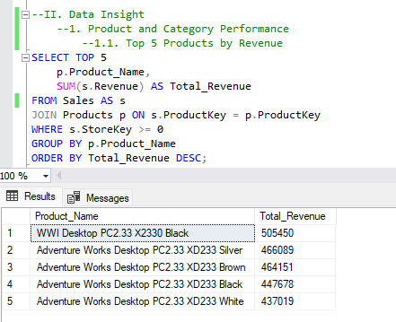

- **Bottom products:** Lighting/fan SKUs (e.g., chandelier, desk lamp, stand fan) sit at the bottom by revenue.

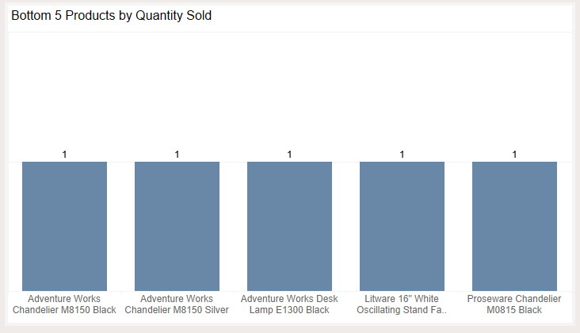 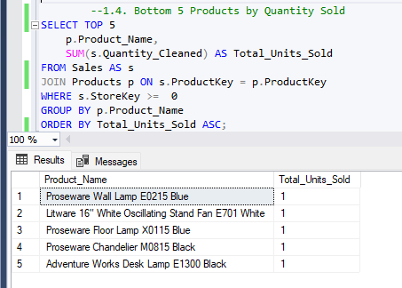

- **Geography — revenue:** United States ≈ $23.8M, United Kingdom ≈ $5.7M, Canada ≈ $3.6M, Australia ≈ $2.1M.

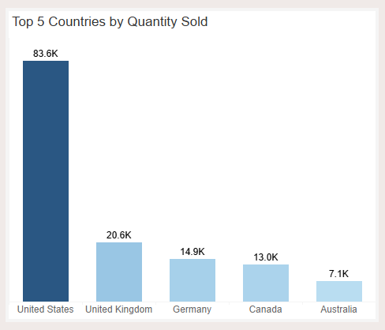 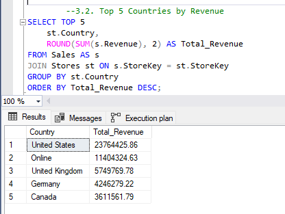

- **Store health:** Median store revenue clusters around the mid‑hundreds‑of‑thousands, useful as a performance benchmark.

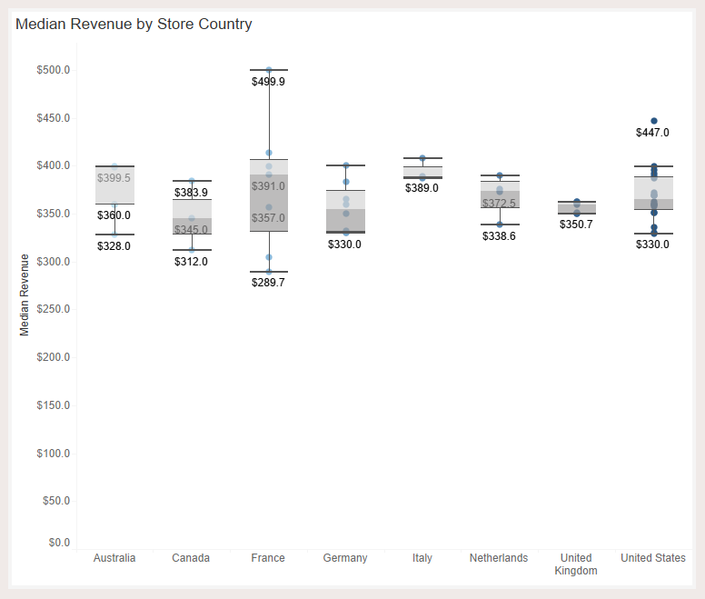 

- **Customer loyalty:** Repeat = 61.18%, One‑time = 38.82%.

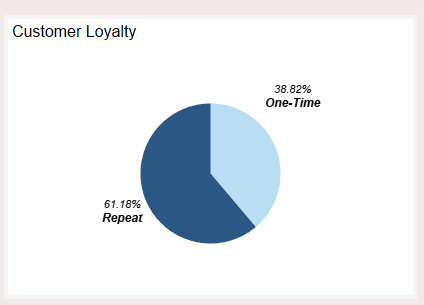 

- **Order frequency:** Most customers place 1–2 orders; opportunities exist to move them to 3+.

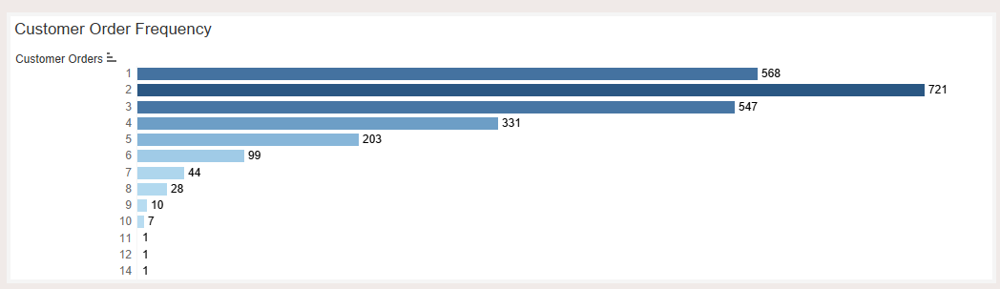 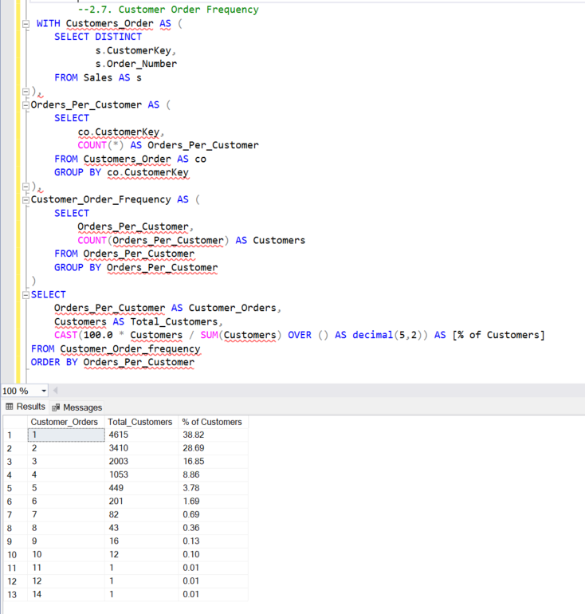

- **Age mix:** Largest group is 60+ (5,459 customers); 30–39 and 40–49 bands are similar (~1.7–1.8K each).

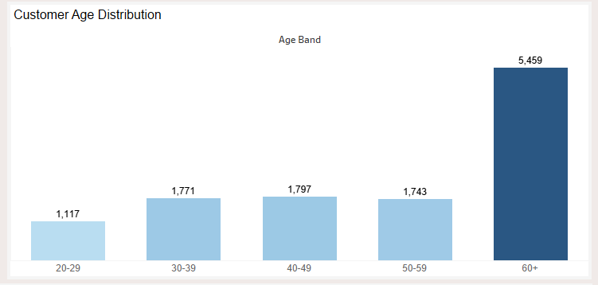 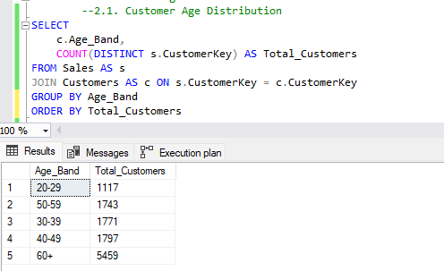

- **Value segments:** Low Value (5,265) > High (3,933) > Mid (2,689) customers.

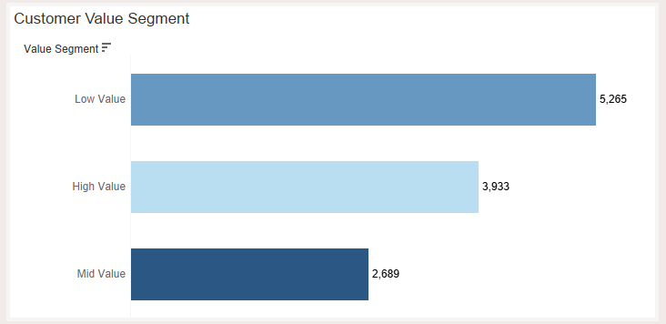 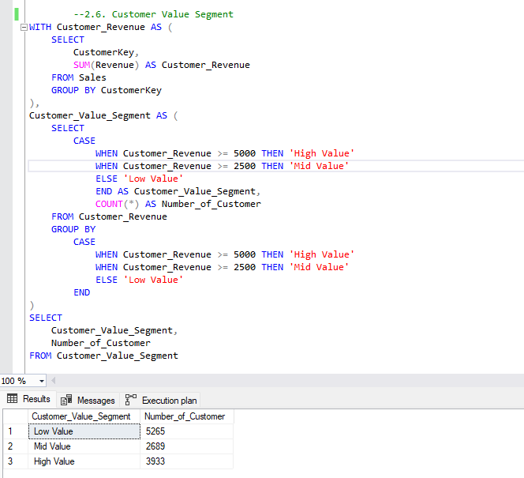

- **Seasonality:** Peak months near $7.8M / $7.5M; trough around $0.6M.

 

- **Delivery data quality:** On‑time 5,108 (20.28%), Late 472 (1.27%), N/A 20,746 (78.45%) → delivery status capture is incomplete.

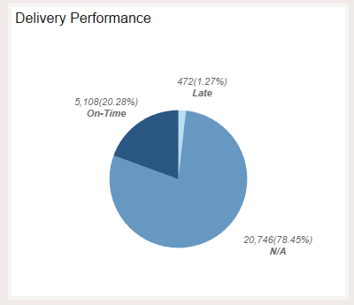 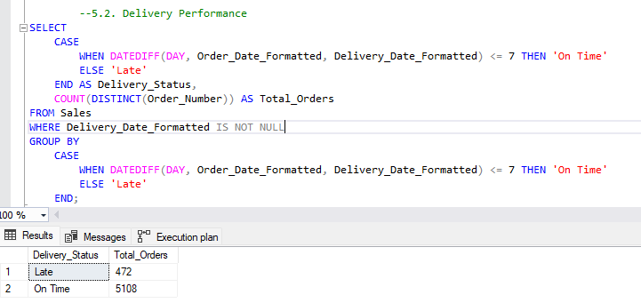

## 🛠️ Recommended Actions

- Focus categories: Prioritise Computers and Home Appliances for inventory, merchandising and campaigns; review/markdown underperforming lighting/fan SKUs.
- Geo targeting: Double‑down on US and UK; test localised promos in Canada and Australia where growth is efficient.
- Retention: Protect the 61% repeat base with VIP tiers, warranty add‑ons and post‑purchase onboarding; nudge 1–2‑order cohorts to 3+ with bundles.
- Data quality: Improve delivery status logging (carrier events, promised vs actual dates) so on‑time metrics are reliable.
- Seasonal planning: Align stock and marketing with peak months; prepare safety stock for top SKUs.
- Value uplift: Use lifecycle marketing to move Low/Mid segments into High (e.g., targeted cross‑sell, financing offers).
